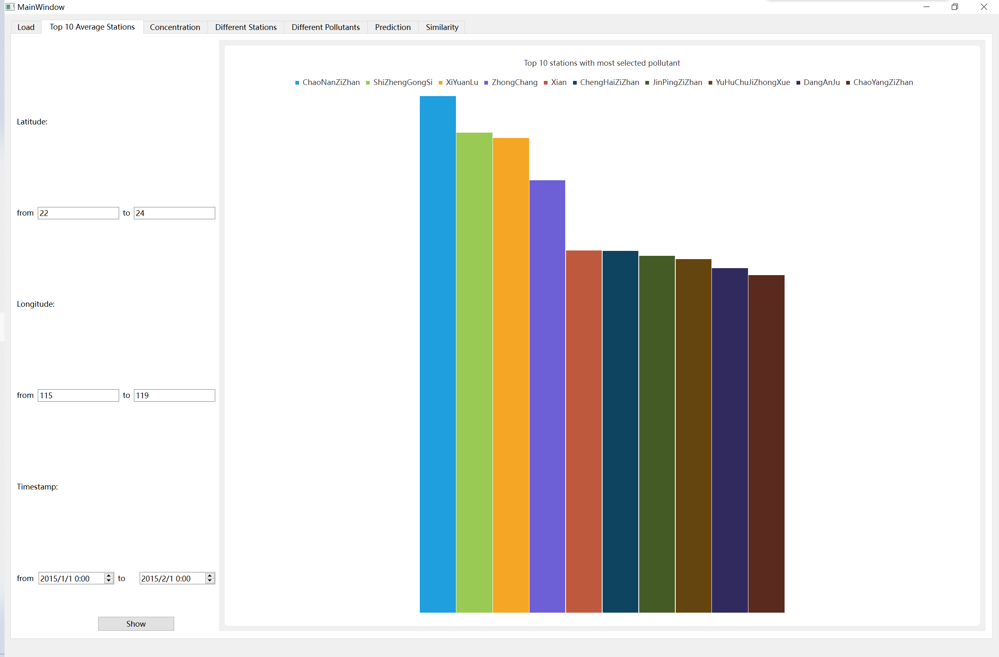
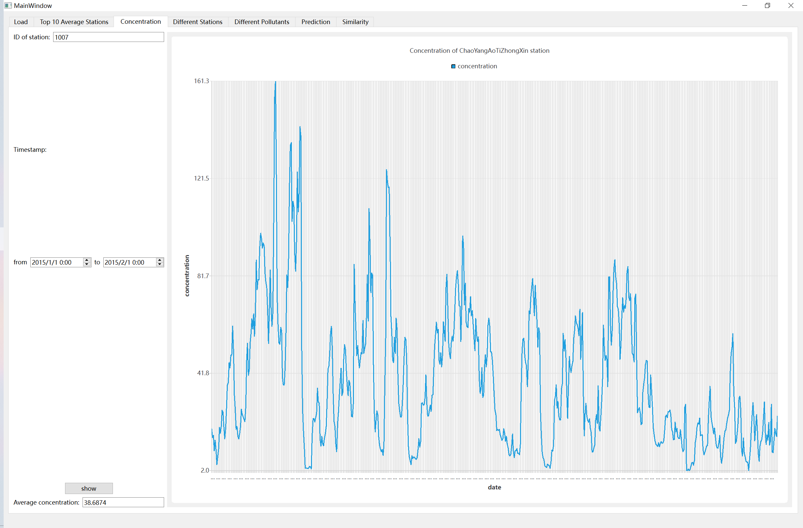
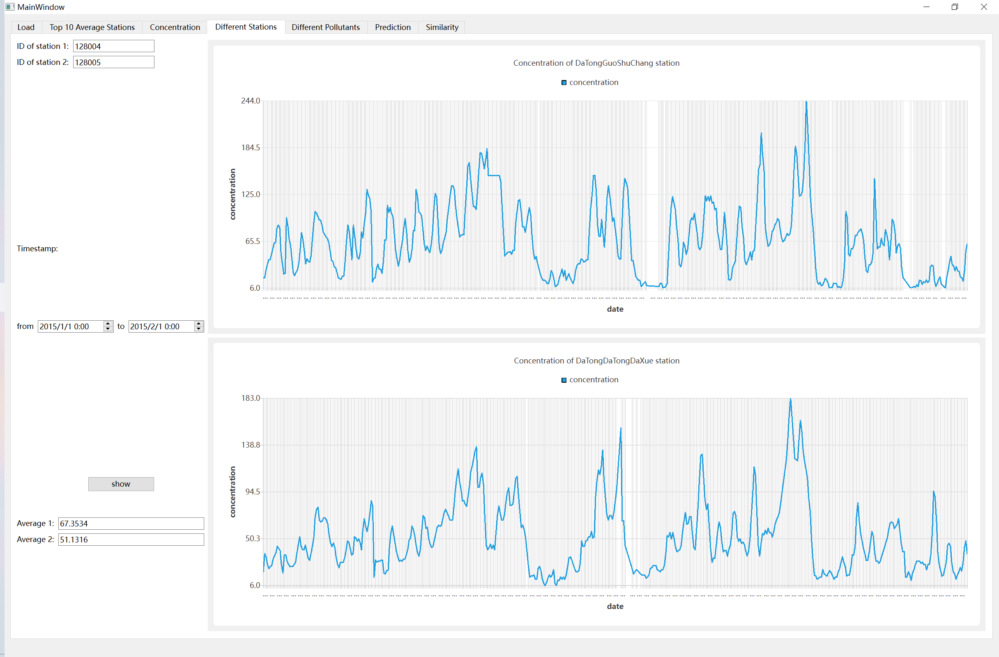
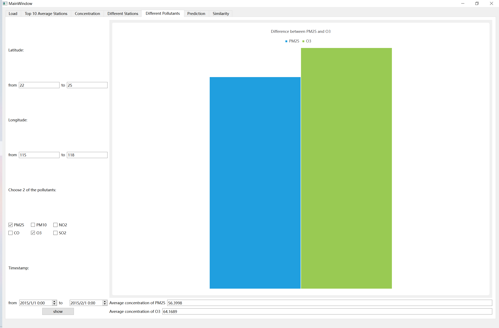
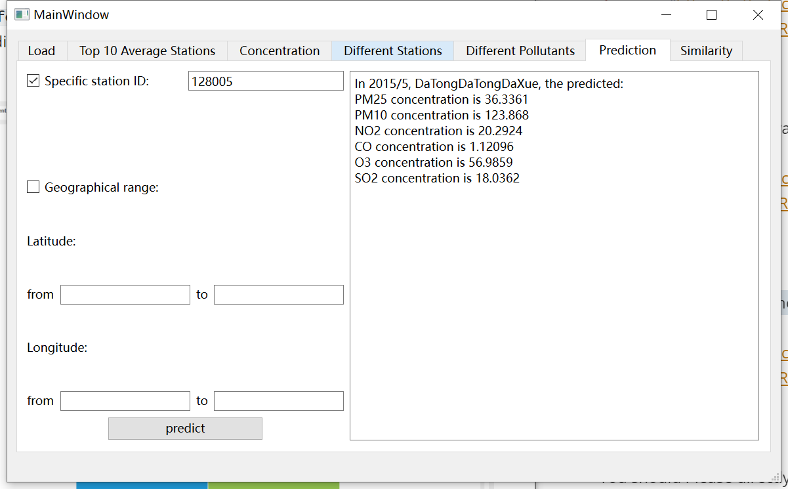
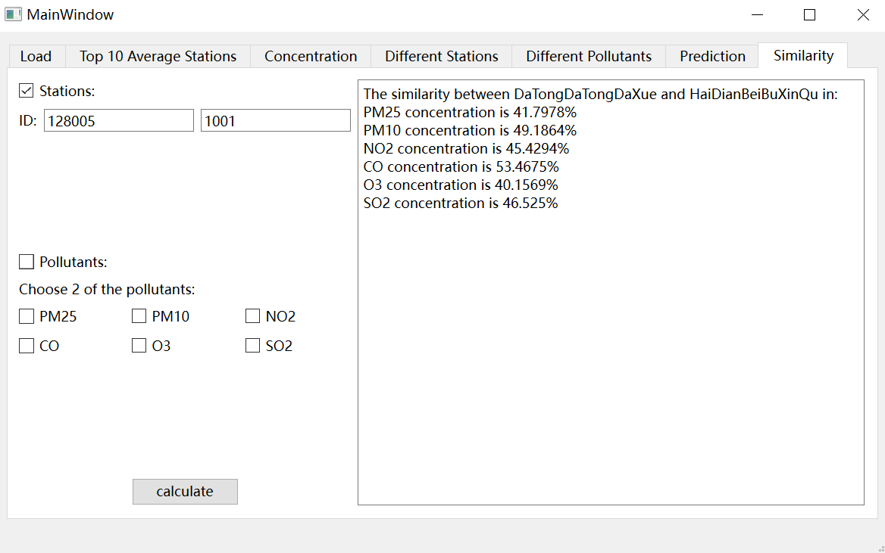
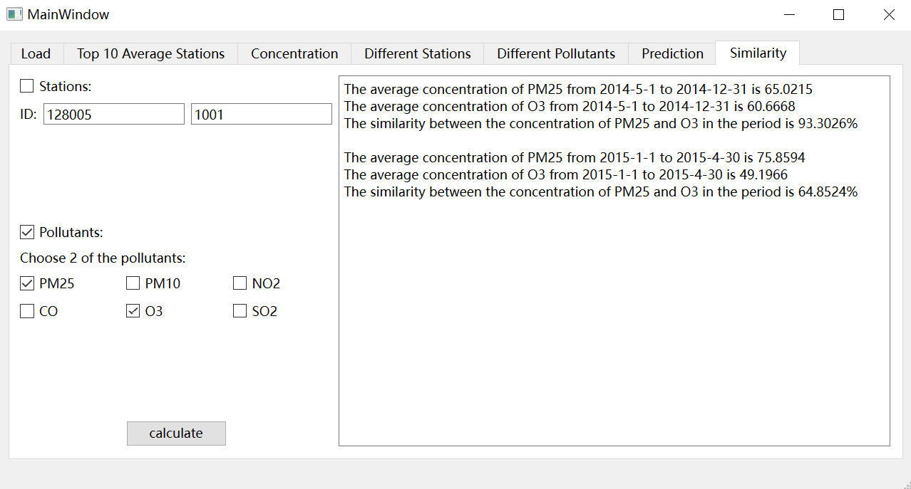

# Introduction to the application
---
This is an application for data analysis and visualization of air quality data.

Here is a README file to let you know how to start with the app. If you are willing to know more detail, please open the `report.pdf` for reference.

## 1. How to launch the GUI?

There are two ways provided to launch the GUI:
+ If you have installed Qt Creator,  just open the folder `./source/final-project` with Qt Creator and run it in the `Debug` mode;
+ if you have not installed Qt Creator, or you want an easy way to start, click into the `release version` folder and run the `final-project.exe` file. (Please make sure to open it under Windows environment!)

## 2. How to use it?

Before using functions in the app, you should first turn to the `Load` page. Please click on the two `select` button, and open the `*.csv` files. The data is stored in `./data` folder. After that, click on the `load` button to load the data. You will be informed if the loading process is done.

### Function 1: Top 10 stations with most selected pollutant

Please first choose the pollutant you are interested in on the `Load` page. Then click on the `Top 10 Average Stations` tab and set the geographical range and the starting and ending timestamp of the time period.

 

### Function 2: Concentration of a specific air pollutant

Please first choose the pollutant you are interested in on the `Load` page. Then click on the `Concentration` tab and set the station and the starting and ending timestamp of the time period.

 

The trend is show in the line chart and the average concentration is shown below.

### Function 3: Comparison between different stations

Please first choose the pollutant you are interested in on the `Load` page. Then click on the `Different Stations` tab and set the stations and the starting and ending timestamp of the time period.

 

 You can compare the difference through the line charts or the average numbers.

 ### Function 4: Comparison between different pollutants

Please directly click on the `Different Pollutants` tab and set the air pollutants, the geographical range, and the starting and ending timestamp of the time period.

 

 You can compare the difference through the bar charts or the average numbers.

 ### Function 5: Prediction

 Please directly click on the `Prediction` tab and select only one check box between specific station and geographical range. Then set the restriction.

 

 It show the predicted concentration of pollutants in the coming month.

 ### Function 6: Similarity

 Please directly click on the `Similarity` tab and select only one check box between stations and pollutants. Then set the restriction.

 
 